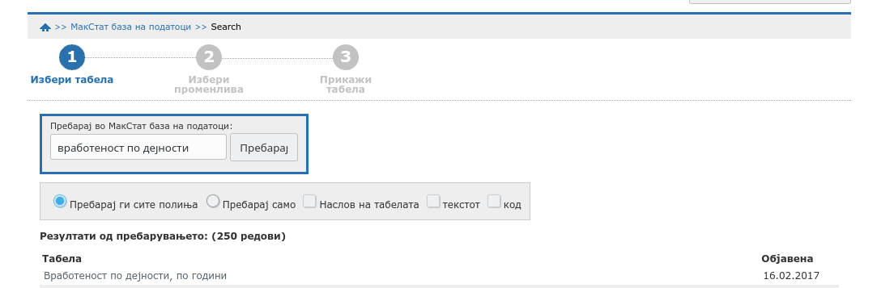
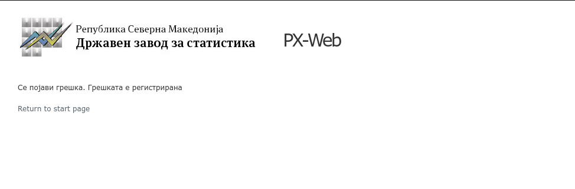

# Добредојдовте, што е PyData и др.

- [Хаклаб КИКА](https://kika.spodeli.org/%d1%87%d0%b5%d1%81%d1%82%d0%be-%d0%bf%d0%be%d1%81%d1%82%d0%b0%d0%b2%d1%83%d0%b2%d0%b0%d0%bd%d0%b8-%d0%bf%d1%80%d0%b0%d1%88%d0%b0%d1%9a%d0%b0/)
- [PyData](https://www.youtube.com/watch?v=J8cVPXnafos)
- [R-Ladies](https://rladies.org/)
- [R as a First Programming Language](https://seankross.com/2019/10/27/R-as-a-First-Programming-Language.html)


# PX-WEB

```{r global_options, include=FALSE}
    options(scipen = 999)
```

## Зошто би користеле друг начин за пристап до податоци кога ги има на web?

[МАКСТАТ база](http://makstat.stat.gov.mk/PXWeb/pxweb/mk/MakStat/)

Често не работи. Баш кога ја спремав оваа презентација сакав да ги земам истите податоци и од web:




## Земи податоци

```{r}
library(pxweb)

#dzs <- pxweb_interactive()
```


```{r}
# PXWEB query 
pxweb_query_list <- 
  list("Сектор"=c("0","1","2","3","4","5","6","7","8","9","10","11","12","13","14","15","16","17","18","19","20"),
       "Година"=c("0","1","2","3","4","5","6","7","8","9","10","11","12","13","14","15","16","17"))

# Download data 
px_data <- 
  pxweb_get(url = "http://makstat.stat.gov.mk/PXWeb/api/v1/mk/MakStat/BDP/BDPInvesGodisni/BDPsporedESS2010/425_NacSmA_Mk_09p2b_01ml.px",
            query = pxweb_query_list)

# Convert to data.frame 
px_data <- as.data.frame(px_data, column.name.type = "text", variable.value.type = "text")

# Get pxweb data comments 
#px_data_comments <- pxweb_data_comments(px_data)
#px_data_comments_df <- as.data.frame(px_data_comments)

# Cite the data as 
#pxweb_cite(px_data)
```

## Разлгедај податоци

```{r}
library(tidyverse)
```


```{r}
# Tidy data
glimpse(px_data)
```

```{r}
names(px_data)
```

```{r}
px_data <- px_data %>% 
  rename(sector = Сектор, year = Година, empl_per_year  = "Вработеност по дејности, по години") %>% 
  mutate(year = as.numeric(as.character(year)))
```

## И направи еден график

```{r}
p1 <- filter(px_data, sector != "Вкупно") %>% 
ggplot() + 
 aes(x = year, y = empl_per_year, group = sector, color = sector) +
 geom_point() + 
 geom_line() + 
 theme_minimal() + 
 theme(legend.position="none")

p1
```

```{r}
library(gghighlight)
```

## Само четири дејности се чини дека ја движат вработеноста; кои се тие?
```{r}
p2 <- filter(px_data, sector != "Вкупно") %>% 
  separate(sector, c("s_code", "s_name"), sep = "\\s", extra = "merge") %>% 
ggplot() +
  aes(x = year, y = empl_per_year, color = s_name) +
  geom_point() +
  geom_line() + 
  gghighlight(max(empl_per_year) > 50000, label_key = s_name, use_direct_label = FALSE) +
  labs(x = "Години", y = "Број на вработени", title = "Земјоделска држава", caption = "Извор: ДЗС") + 
  scale_y_continuous(labels = scales::comma_format()) + 
  theme_minimal() +
  theme(legend.position = "bottom", legend.title = element_blank(),
        legend.direction = "vertical")


p2
```

# CKANR

```{r}
library(ckanr)
```

## data.gov.mk, но...

```{r}
ckanr_setup(url = "http://data.gov.mk/", key = "your api key")

package_table <- package_list(as = "table")

package_table
```

```{r}
search_results <- package_search()

search_results
```

```{r}
#package_show("b348a53f-cfa2-4afa-b166-76e1bd47675f")

# Но нешто не работи?
```

## Друг ckan портал

```{r}
# CSV file
ckanr_setup("http://datamx.io")

package_table <- package_list(as = "table")

package_search(q = "Monterrey - CIC")

package_show("9169cf41-a72c-412d-a48c-5aef12b5680a")
```

## pkg, res, etc.

```{r}
pkg <- package_show("9169cf41-a72c-412d-a48c-5aef12b5680a")
```

```{r}
res <- resource_show(id = "6145a539-cbde-4b0d-a3d3-d1a5eb013f5c")

res
```

```{r}
head(ckan_fetch(res$url))

df <- ckan_fetch(res$url, store = "session")
```

```{r}
glimpse(df)

# И одовде па натаму може да се уредува и визуелизира
```

# Формат и идеи за понатаму